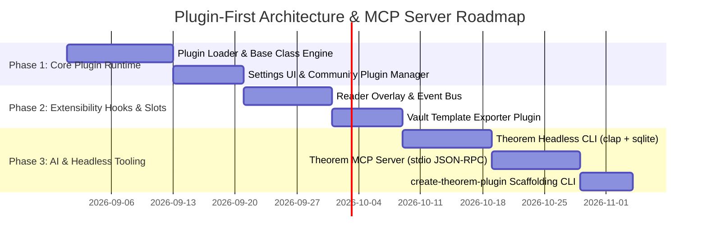

# Plugin-First Extensibility & AI-Agent Architecture Plan

**Date**: 2026-08-30  
**Status**: Architecture Blueprint  
**Area**: Plugin Engine / Extensibility API / Headless CLI / Model Context Protocol (MCP)  

---

## 1. Executive Summary & Design Philosophy

Theorem's long-term vision is to become the **Obsidian of Reading Apps** — a fast, local-first reading hub that is not a closed silo, but a modular platform where developers and readers can easily build custom tools, AI integrations, note exporters, custom themes, and reading overlays.

### Core Tenets of the Plugin-First Architecture:
1. **Low Friction (Obsidian-Style Developer Experience)**: Anyone who knows standard JavaScript/TypeScript and React can build and publish a plugin in minutes.
2. **Zero Core Bloat**: Advanced niche workflows (e.g. Anki flashcard generation, Notion sync, Bionic reading, Zotero bibtex citation matching, DJVU loaders) live as community plugins rather than cluttering the core app.
3. **AI-Agent & MCP Native**: Every plugin can expose tools not just to the UI, but directly to AI models (Claude, Cursor, Antigravity, local LLMs) via the Theorem Model Context Protocol (MCP) server.
4. **Local-First & Hot-Reloadable**: Plugins live in `$APPDATA/plugins/<plugin-id>/` with instant live hot-reloading during development.

---

## 2. System Architecture & Component Hierarchy

```
┌─────────────────────────────────────────────────────────────────────────────────┐
│                           PLUGIN RUNTIME ECOSYSTEM                              │
│                    (~/.config/theorem/plugins/<plugin-id>/)                     │
│       ├── manifest.json      (Metadata, permissions, version)                   │
│       ├── main.js            (Bundled JS module exporting default Plugin class) │
│       └── styles.css         (Scoped custom CSS rules)                          │
└────────────────────────────────────────┬────────────────────────────────────────┘
                                         │
                                         ▼
┌─────────────────────────────────────────────────────────────────────────────────┐
│                         THEOREM PLUGIN RUNTIME MANAGER                          │
│ ┌─────────────────────────────────────────────────────────────────────────────┐ │
│ │                         TheoremPlugin Base Class                            │ │
│ │  - onload() / onunload()                                                    │ │
│ │  - registerCommand({ id, name, callback, hotkey })                          │ │
│ │  - registerSettingTab(SettingTab)                                           │ │
│ │  - registerRibbonIcon(icon, title, callback)                                │ │
│ │  - registerView(viewType, ReactComponent)                                  │ │
│ │  - registerReaderOverlay({ name, component, priority })                     │ │
│ │  - registerVaultExporter({ id, name, exportHandler })                       │ │
│ │  - registerFormatLoader({ extensions, loader })                             │ │
│ │  - registerMcpTool({ name, description, schema, handler })                  │ │
│ └─────────────────────────────────────────────────────────────────────────────┘ │
│ ┌─────────────────────────────────────────────────────────────────────────────┐ │
│ │                             EVENT DISPATCH BUS                              │ │
│ │  - app.on('book:open', (book) => ...)                                       │ │
│ │  - app.on('reader:relocate', (loc) => ...)                                  │ │
│ │  - app.on('highlight:create', (highlight) => ...)                           │ │
│ │  - app.on('note:vault-sync', (payload) => ...)                              │ │
│ └─────────────────────────────────────────────────────────────────────────────┘ │
└────────────────────────────────────────┬────────────────────────────────────────┘
                                         │
                    ┌────────────────────┴────────────────────┐
                    ▼                                         ▼
      ┌───────────────────────────┐             ┌───────────────────────────┐
      │   REACT 19 UI SLOTS       │             │  NATIVE RUST & MCP SERVER │
      │ - Custom Sidebar Views    │             │ - Local FS & SQLite Access│
      │ - Reader Text Overlays    │             │ - Stdio JSON-RPC for AI   │
      │ - Context Menu Actions    │             │ - Ripgrep In-Book Search  │
      └───────────────────────────┘             └───────────────────────────┘
```

---

## 3. Plugin Manifest & Structure

Each plugin is a self-contained directory containing three files:

```
my-custom-plugin/
├── manifest.json
├── main.js
└── styles.css
```

### `manifest.json`
```json
{
  "id": "theorem-obsidian-smart-vault",
  "name": "Smart Obsidian Vault Exporter",
  "version": "1.0.0",
  "minAppVersion": "1.3.0",
  "description": "Customizable template-driven highlight and metadata sync into Obsidian vaults.",
  "author": "Community Developer",
  "isDesktopOnly": false,
  "permissions": ["vault", "annotations", "mcp"]
}
```

---

## 4. The Extensibility API Surface

Every plugin extends `TheoremPlugin` provided by the `@theorem/plugin-sdk`:

```ts
import { TheoremPlugin, SettingTab, Setting } from "@theorem/plugin-sdk";

export default class SmartVaultPlugin extends TheoremPlugin {
    async onload() {
        console.log("Loading Smart Obsidian Vault Plugin");

        // 1. Register a command in the Command Palette (Ctrl+P / Cmd+P)
        this.registerCommand({
            id: "sync-current-book-to-vault",
            name: "Sync Current Book to Obsidian Vault",
            hotkey: "Mod+Shift+V",
            callback: () => this.syncCurrentBook(),
        });

        // 2. Register a live event hook
        this.registerEvent(
            this.app.on("highlight:create", (highlight) => {
                if (this.settings.autoSyncOnHighlight) {
                    this.appendHighlightToVault(highlight);
                }
            })
        );

        // 3. Register a custom AI tool for the Theorem MCP Server!
        this.registerMcpTool({
            name: "export_book_summary_to_vault",
            description: "Allows an AI agent to write an AI-generated book summary into the user's Obsidian vault.",
            inputSchema: {
                type: "object",
                properties: {
                    bookId: { type: "string" },
                    summaryMarkdown: { type: "string" },
                },
                required: ["bookId", "summaryMarkdown"],
            },
            handler: async (args) => {
                await this.writeSummary(args.bookId, args.summaryMarkdown);
                return { success: true, message: "Summary saved to vault." };
            },
        });

        // 4. Register a Settings UI Tab
        this.registerSettingTab(new SmartVaultSettingTab(this.app, this));
    }

    async onunload() {
        console.log("Unloading Smart Obsidian Vault Plugin");
    }
}
```

---

## 5. The 6 Core Plugin Extension Categories

### A. Reader Overlays & Sensory Modifiers
- **Hook**: `registerReaderOverlay({ id, render, priority })`
- **Use Cases**:
  - **Bionic Reading Plugin**: Applies dynamic saccadic eye fixation bolding to the first letters of words in the active viewport.
  - **Translation & Dictionary Glosser**: Injects floating word definitions or interlinear translations between paragraphs.
  - **Margin Commentary**: Renders margin sticky notes alongside paragraphs on large widescreen monitors.

### B. Custom Note & Vault Exporters
- **Hook**: `registerVaultExporter({ id, name, exportHandler })`
- **Use Cases**:
  - **Template-Driven Markdown Exporter**: Full user customization with Jinja/Mustache syntax (`{{author}}/{{title}}.md`, Callouts, YAML Frontmatter).
  - **Notion / Readwise / RemNote / Heptabase Exporters**: Syncs highlights to external cloud note apps.
  - **Anki Flashcard Generator**: Converts marked sentences into `.apkg` or pushes directly to AnkiConnect.

### C. Custom Document Formats & Audio Encoders
- **Hook**: `registerFormatLoader({ extensions, loader })`
- **Use Cases**:
  - **DJVU Reader**: Decodes `.djvu` documents into rendered canvas pages.
  - **Audiobook M4B / MP3 Player**: Plays chapterized audiobooks with embedded chapter markers.
  - **Markdown / Plain Text Reader**: Treats directories of `.md` files as books.

### D. Custom UI Panes & Workbench Tabs
- **Hook**: `registerView(viewType, ReactComponent)`
- **Use Cases**:
  - **Book Knowledge Graph View**: Interactive 2D/3D force-directed graph connecting books by author, tags, and shared concepts.
  - **AI Reading Assistant Panel**: Interactive chat sidebar that reads the current chapter text and answers questions.
  - **Reading Heatmap & Analytics**: Deep GitHub-style activity charts and velocity graphs.

### E. AI Agent Integration & MCP Tools
- **Hook**: `registerMcpTool({ name, description, inputSchema, handler })`
- **Use Cases**:
  - Plugins can dynamically expose new tools to Claude Desktop, Cursor, and local agents over the Theorem MCP server.
  - An AI agent can run specialized plugin workflows (e.g. *"Generate a concept map for chapter 2 and save it to my vault"*).

---

## 6. Headless CLI & Theorem MCP Server Architecture

To support autonomous AI agents and terminal power users, Theorem will ship a standalone headless companion binary (`theorem-cli`):

```bash
# JSON output for AI scripting
theorem list --json

# Read full text or chapter excerpts
theorem read "thinking-in-systems" --chapter 3 --format markdown

# Search library content
theorem search "leverage points" --json

# Run an MCP server over stdio for Claude Desktop / Cursor
theorem mcp-server
```

### Configuration for Claude Desktop / Cursor (`claude_desktop_config.json`):
```json
{
  "mcpServers": {
    "theorem": {
      "command": "theorem",
      "args": ["mcp-server"]
    }
  }
}
```

---

## 7. Developer Experience (DX) & Scaffolding

To empower developers to create plugins effortlessly:

1. **Official Template**: `create-theorem-plugin`
   ```bash
   pnpm create theorem-plugin my-plugin
   cd my-plugin && pnpm install && pnpm dev
   ```
2. **Hot-Reloading**: Symlinking `my-plugin/` into `~/.config/theorem/plugins/` live-reloads the plugin inside Theorem instantly upon code change without restarting the app.
3. **SDK Package**: `@theorem/plugin-sdk` published to npm with full TypeScript types, UI component helpers, and store hooks.

---

## 8. Implementation Roadmap



### Phase 1: Plugin Manager & Runtime Loader
- [ ] Create `src/core/plugins/PluginManager.ts` and `TheoremPlugin.ts` base class.
- [ ] Build plugin directory scanner in `$APPDATA/plugins/`.
- [ ] Build Community & Installed Plugins view in Theorem Settings.

### Phase 2: Extension Hooks & Overlays
- [ ] Implement Reader Overlay injection points in `FoliateEngine` and `PDFJsEngine`.
- [ ] Implement event dispatch bus (`book:open`, `highlight:create`, `location:change`).
- [ ] Build reference **Obsidian Smart Vault** plugin with customizable templates.

### Phase 3: Headless CLI & MCP Server
- [ ] Create `src-tauri/crates/theorem-cli` with `list`, `read`, `search`, and `annotate` commands.
- [ ] Create `src-tauri/crates/theorem-mcp` exposing stdio JSON-RPC MCP tools for AI agents.
- [ ] Publish `@theorem/plugin-sdk` and `create-theorem-plugin`.
