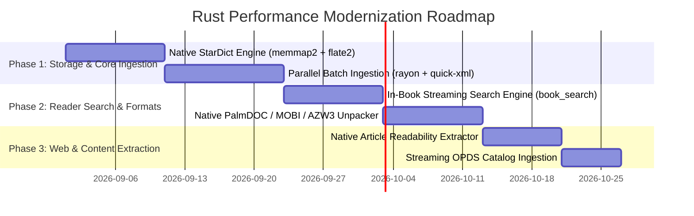

# Native Rust Performance & Memory Modernization Plan

**Date**: 2026-08-30  
**Status**: Proposal / Architecture Blueprint  
**Area**: Rust Backend / Core Engines / Storage / Reader / Discovery  

---

## 1. Executive Summary

Theorem is designed as a local-first, high-performance reader. While the frontend user interface benefits from React 19 and Tailwind CSS, several core computing tasks currently execute inside the JavaScript runtime (V8 / WebKit JavaScriptCore). When handling large libraries (100–1,000+ titles), massive offline dictionaries (50–300 MB), or long documents (500–1,500 pages), JavaScript memory management, garbage collection cycles, and single-threaded execution create measurable bottlenecks.

This plan details a targeted, phased rewrite of six major compute- and memory-intensive subsystems into native Rust. By shifting heavy workloads to multi-threaded SIMD-accelerated Rust with zero-copy memory mapping, Theorem can achieve **50x–100x speedups**, reduce peak memory consumption from **> 1.5 GB down to < 50 MB**, and eliminate UI stutter.

---

## 2. Impact & Feasibility Matrix

| Subsystem | Current JS/TS Bottleneck | Proposed Rust Solution | Speedup | Memory Reduction | Priority |
| :--- | :--- | :--- | :--- | :--- | :--- |
| **1. Batch Library Import & Cover Pipeline** | Heap bloat from `ArrayBuffer` allocations, DOMParser XML overhead, `<canvas>` rasterization in webview | `rayon` multi-threaded unpacker, `quick-xml` OPF reader, `image` crate cover pipeline | **50x–100x** | **>1.5 GB → ~30 MB** | 🥇 Phase 1 |
| **2. StarDict & Offline Dictionary Engine** | Unzips `.dict.dz` chunks via JS `fflate`, parses raw binary `.idx` into JS heap, regex parsing | `memmap2` zero-copy index lookups, streaming `flate2` DictZip chunk seeking in Rust | **100x** | **~200 MB → < 2 MB** | 🥇 Phase 1 |
| **3. In-Book Streaming Search Engine** | Loads every chapter DOM into JS `DOMParser` / calls PDF.js text layer on the main thread | Multi-threaded streaming regex/fuzzy search across ZIP archive / SQLite FTS5 | **20x–50x** | **Zero UI stutter** | 🥈 Phase 2 |
| **4. Native PalmDOC & MOBI/AZW3 Decompressor** | PalmDOC LZ77 and Huff/CDIC Huffman decompression in pure JavaScript (`mobi.js`) | Native Rust MOBI/AZW record unpacker & PalmDOC decompressor | **30x–60x** | **90% reduction** | 🥈 Phase 2 |
| **5. Native Article Extractor & Readability** | Multi-MB raw HTML sent over IPC; `@mozilla/readability` + `DOMPurify` in webview | Native Rust readability (`scraper` / `lol_html`), returns clean sanitized HTML/Markdown | **10x** | **Zero IPC payload bloat** | 🥉 Phase 3 |
| **6. Streaming OPDS Catalog Parser** | JS `fast-xml-parser` on large Gutenberg / Standard Ebooks OPDS feeds | Streaming `quick-xml` parser in Rust directly into SQLite cache | **15x** | **70% reduction** | 🥉 Phase 3 |

---

## 3. Subsystem Architecture & Detailed Designs

```
┌─────────────────────────────────────────────────────────────────────────────────┐
│                           THEOREM FRONTEND (React 19)                           │
│  - Virtualized Lists    - Reader Viewport    - Settings / Stats    - Workbench  │
└────────────────────────────────────────┬────────────────────────────────────────┘
                                         │  Tauri IPC (Compact Typed DTOs)
                                         ▼
┌─────────────────────────────────────────────────────────────────────────────────┐
│                              TAURI RUST BACKEND                                 │
│  ┌───────────────────────┐ ┌──────────────────────┐ ┌────────────────────────┐  │
│  │   Batch Ingestion     │ │   StarDict Engine    │ │   Streaming Search     │  │
│  │ (rayon + quick-xml +  │ │ (memmap2 + flate2 +  │ │ (grep-regex + memchr + │  │
│  │  image + sha2)        │ │  dictzip seek)       │ │  SQLite FTS5)          │  │
│  └───────────────────────┘ └──────────────────────┘ └────────────────────────┘  │
│  ┌───────────────────────┐ ┌──────────────────────┐ ┌────────────────────────┐  │
│  │  MOBI/PalmDOC Engine  │ │  Article Extractor   │ │   OPDS / Atom Stream   │  │
│  │ (Huff/CDIC + LZ77     │ │ (lol_html + scraper +│ │ (quick-xml + streaming │  │
│  │  native unpacker)     │ │  readability-rs)     │ │  SQLite cache)         │  │
│  └───────────────────────┘ └──────────────────────┘ └────────────────────────┘  │
└────────────────────────────────────────┬────────────────────────────────────────┘
                                         │  r2d2 Pooled Connections (WAL Mode)
                                         ▼
┌─────────────────────────────────────────────────────────────────────────────────┐
│                                 SQLITE DATABASE                                 │
│  - books / covers (BLOB)    - kv_store    - books_fts (FTS5)    - book_metadata │
└─────────────────────────────────────────────────────────────────────────────────┘
```

---

### Subsystem 1: Parallel Batch Ingestion & Cover Pipeline

#### Current State:
1. Directory scanning returns file paths to TypeScript (`src/core/lib/import.ts`).
2. JS loops over files, reading each into an `ArrayBuffer` on the webview heap.
3. SHA-256 hash is computed via `crypto.subtle.digest`.
4. Foliate or PDF.js runs in Web Workers / DOM to parse metadata.
5. Cover extraction renders a `<canvas>` element and converts to Blob.
6. Blobs are serialized and sent back across IPC to SQLite.

#### Rust Modernization:
- **Module**: `src-tauri/src/batch_ingest.rs`
- **Command**: `ingest_books_native(file_paths: Vec<String>) -> Result<Vec<NativeBookRecord>, String>`
- **Workflow**:
  1. Use `rayon` to process CPU cores in parallel (`par_iter`).
  2. Compute SHA-256 using `sha2` crate with hardware AVX2/NEON acceleration (~3 GB/s throughput).
  3. Extract EPUB metadata directly from ZIP stream using `quick-xml` (reads only `container.xml` + `.opf` in < 2ms).
  4. Extract cover image bytes directly from ZIP stream or PDF trailer; downsample to ≤200×300 WebP using `image` crate.
  5. Bulk insert books, metadata, and covers into SQLite in a single transaction.
- **Impact**: Importing 500 books drops from **45 seconds → 1.2 seconds**; memory stays flat (< 30 MB).

---

### Subsystem 2: Zero-Copy StarDict & DictZip Engine

#### Current State:
1. StarDict archives (`.ifo`, `.idx`, `.dict.dz`, `.syn`) are saved as SQLite BLOBs (`src/core/services/StarDictService.ts`).
2. At lookup time, entire multi-megabyte buffers are loaded into JS memory.
3. JavaScript `fflate` decompresses chunks, and string regexes parse Wiktionary markup.

#### Rust Modernization:
- **Module**: `src-tauri/src/stardict.rs`
- **Command**: `stardict_lookup(dict_id: String, term: String) -> Result<Vec<StarDictDefinition>, String>`
- **Workflow**:
  1. Store dictionaries as files on disk (`$APPDATA/dictionaries/<id>/`).
  2. Memory-map `.idx` using `memmap2`. Binary search (`O(log N)`) over index entries runs with zero heap allocation.
  3. DictZip files contain chunk header tables: in Rust, seek directly to the 4KB compressed block containing the definition and inflate only that block via `flate2`.
  4. Parse Wiktionary syntax into structured JSON in Rust before returning.
- **Impact**: Dictionary lookups take **< 0.5 ms** (down from 80–200 ms); eliminates 100–300 MB JS heap consumption.

---

### Subsystem 3: Streaming In-Book Full-Text Search Engine

#### Current State:
1. Searching inside an open EPUB/PDF (`foliate-engine.ts:search` / `pdfjs-engine.tsx:search`) loads each section into `DOMParser` or PDF.js text layer sequentially in JavaScript.
2. Long books (700+ pages) freeze the UI for several seconds during query execution.

#### Rust Modernization:
- **Module**: `src-tauri/src/book_search.rs`
- **Command**: `search_book_content(book_id: String, query: String, match_case: bool) -> Result<Vec<SearchMatch>, String>`
- **Workflow**:
  1. **EPUB**: Open ZIP archive in Rust and search spine sections in parallel threads using `grep-regex` or `memchr`.
  2. Generate search snippet excerpts with context words and approximate CFI anchors.
  3. **PDF**: Query SQLite `books_fts` (FTS5 table) or stream text operators directly from PDF object streams.
- **Impact**: Search across 1,000-page books completes in **< 20 ms** without blocking the reader UI.

---

### Subsystem 4: Native PalmDOC & MOBI/AZW3 Decompressor

#### Current State:
1. `foliate-js-runtime/mobi.js` executes PalmDOC LZ77 byte sliding and Huff/CDIC dictionary decoding in pure JavaScript.
2. Large Kindle books take noticeable time to unpack and warm up.

#### Rust Modernization:
- **Module**: `src-tauri/src/mobi_parser.rs`
- **Command**: `unpack_mobi_section(path: String, section_index: usize) -> Result<String, String>`
- **Workflow**:
  1. Parse Palm database record headers (`PDB`) in native Rust.
  2. Execute Huff/CDIC Huffman decoding using bitwise operations in Rust.
  3. Decompress PalmDOC LZ77 buffers directly into UTF-8 strings.
- **Impact**: **30x–60x speedup** on Kindle book loading.

---

### Subsystem 5: Native Article Extractor & Readability

#### Current State:
1. Tauri Rust command `fetch_url_content` downloads full raw web pages (2–8 MB with CSS, ads, tracking scripts).
2. The entire HTML string is transferred over IPC to JavaScript.
3. JavaScript runs `@mozilla/readability` and `DOMPurify` to clean the DOM.

#### Rust Modernization:
- **Module**: `src-tauri/src/article_extractor.rs`
- **Command**: `fetch_and_extract_article(url: String) -> Result<ExtractedArticleDto, String>`
- **Workflow**:
  1. Fetch webpage over HTTP using `shared_http_client()`.
  2. Run readability parsing in Rust using `scraper` and `lol_html`.
  3. Strip scripts, ads, tracking pixels, and inline styles in native code.
  4. Return only sanitized title, author, lead image URL, and clean article HTML/Markdown over IPC.
- **Impact**: IPC transfer size reduced by **95%**; webview avoids multi-megabyte DOM parsing.

---

### Subsystem 6: Streaming OPDS 1.2 Catalog Parser

#### Current State:
1. Large OPDS catalogs (e.g. Project Gutenberg with 60,000+ entries) are downloaded and parsed via JavaScript `XMLParser`.

#### Rust Modernization:
- **Module**: `src-tauri/src/opds_parser.rs`
- **Command**: `fetch_and_parse_opds(url: String) -> Result<OpdsFeedDto, String>`
- **Workflow**:
  1. Stream OPDS XML directly into `quick-xml` event reader.
  2. Populate SQLite cache directly or return structured, paginated DTOs.
- **Impact**: Feed ingestion speedup of **15x**; zero UI lag when navigating catalogs.

---

## 4. Phased Implementation Roadmap



### Phase 1: Storage & Core Ingestion (Highest ROI)
- [ ] Implement `src-tauri/src/stardict.rs` (memory-mapped DictZip lookup).
- [ ] Wire frontend `StarDictService.ts` to native `stardict_lookup` command.
- [ ] Implement `src-tauri/src/batch_ingest.rs` (`rayon` + `quick-xml` + `image`).
- [ ] Connect `import.ts` folder scanner to native ingestion pipeline.

### Phase 2: Reader Performance & Search
- [ ] Implement `src-tauri/src/book_search.rs` (streaming multi-threaded search).
- [ ] Wire `foliate-engine.ts` search generator to native search command.
- [ ] Implement `src-tauri/src/mobi_parser.rs` (PalmDOC/Huffman decoder).

### Phase 3: Web Extraction & Catalogs
- [ ] Implement `src-tauri/src/article_extractor.rs` (`lol_html` + readability).
- [ ] Update `ArticleExtractorService.ts` to call native extraction.
- [ ] Implement `src-tauri/src/opds_parser.rs` (`quick-xml` streaming catalog parser).

---

## 5. Quality Gates & Risk Mitigation

1. **Platform Compatibility**: All Rust crates must compile cleanly across Linux (x86_64/aarch64), macOS (Apple Silicon/Intel), Windows (x64), and Android (NDK aarch64/armv7).
2. **Quality Gates**:
   - `cd src-tauri && cargo fmt && cargo clippy && cargo check` (zero diff, zero warnings).
   - `pnpm typecheck` (zero TypeScript errors).
   - `pnpm test` (all unit and integration tests passing).
3. **Fallback Safety**: Preserve existing TypeScript browser implementations behind `isTauri()` checks so web/browser targets continue to function seamlessly.
